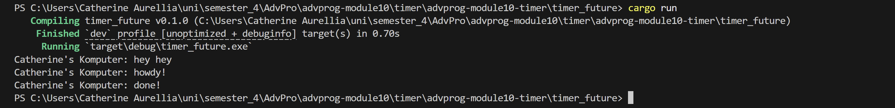

# advprog-module10-timer

### Tutorial 1.2

Even though the line "Catherine's Komputer: hey hey" comes after the spawner.spawn(...) line, it is printed first in the output because it is the main function.

The line spawner.spawn(...) does not run the async block immediately, it just schedules the task for later. The actual async task: printing "Catherine's Komputer: howdy!" and "Catherine's Komputer: done!" starts running only after we call executor.run().